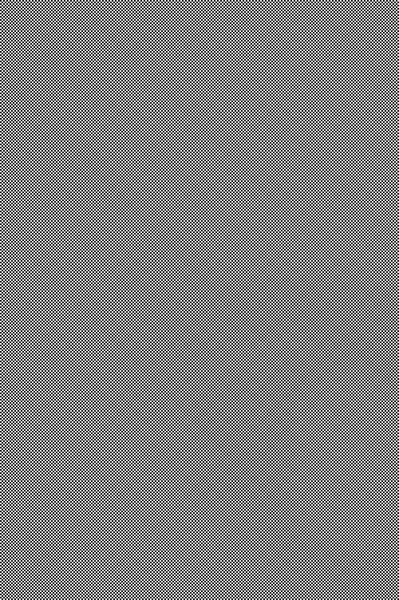
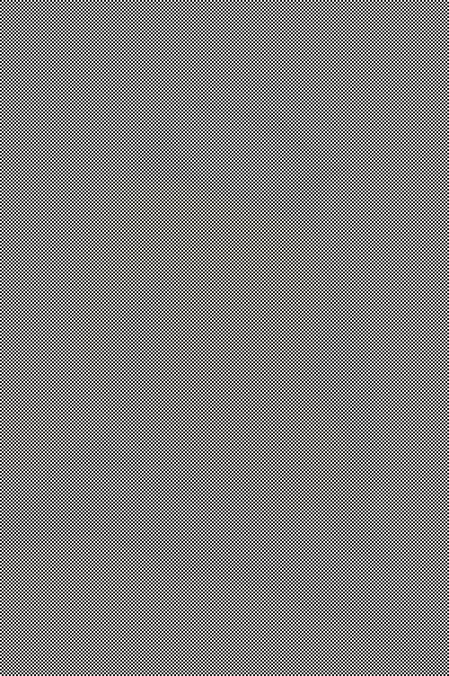

# Hidden

Hidden images, those images are "hidden" in a pattern of rectangles. Try zooming in and you'll see just black rectangles...

## Install pillow

```sh
pip3 install pillow
```

## Usage

```sh
python3 main.py --file FILE
```

## Examples


<br/>
<br/><br/>
